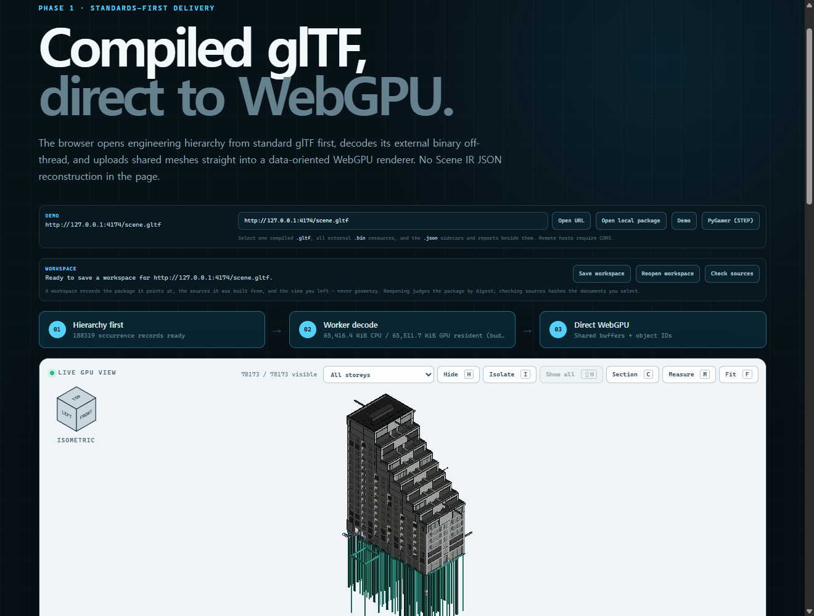
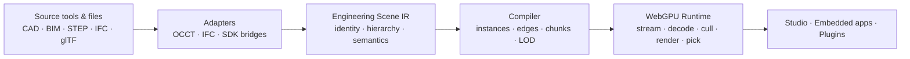

<p align="center">
  <a href="https://1n01raymond.github.io/naru/">
    
  </a>
</p>

<p align="center">
  <strong>English</strong> ·
  <a href="README.ko.md">한국어</a> ·
  <a href="README.ja.md">日本語</a> ·
  <a href="README.zh-CN.md">简体中文</a>
</p>

<p align="center">
  <a href="https://1n01raymond.github.io/naru/"></a>
  <a href="https://github.com/1n01raymond/naru/actions/workflows/ci.yml"></a>
  <a href="LICENSE"></a>
  
  
  <a href="CONTRIBUTING.md"></a>
</p>

<p align="center">
  <strong>Bring engineering models to the Web—without replacing the tools that created them.</strong>
  <br />
  An open-source studio, compiler, and WebGPU runtime for massive CAD, BIM, and engineering scenes.
</p>

<p align="center">
  <a href="https://1n01raymond.github.io/naru/"><strong>▶&nbsp;Open the live Studio demo</strong></a>
  — a real four-discipline IFC federation, streamed over plain HTTP Ranges. Nothing to install.
  <br />
  <sub>Measured at real-large scale: the 839.9 MB <code>sixty5</code> federation reaches a first
  coarse frame of all 78,173 renderable occurrences in 4.5 s; target detail is admitted under
  separate fixed 64 MiB decoded/GPU budgets, excluding total process memory
  (<a href="artifacts/ifc/sixty5-first-frame/README.md">evidence</a>).</sub>
</p>

> [!IMPORTANT]
> NARU has completed its evidence-gated Phase 1 vertical slice. The repository
> contains a working public Studio, compiler, WebGPU runtime, and reproducible
> evidence, but remains alpha-quality software rather than a production viewer.

## What already runs in the browser

Nothing below is a mockup or a roadmap item: every number links to a committed
evidence record that CI re-validates, and the screenshots are the exact
captures those records pin by digest.

<table>
  <tr>
    <td width="50%" valign="top">
      <a href="artifacts/browser-matrix/README.md">
        
      </a>
      <br />
      <sub><strong>A real STEP assembly, end to end.</strong> Adafruit's
      PyGamer board: 85 part occurrences sharing 34 meshes, 162,838 unique
      triangles, 13,897 explicit CAD edge segments, and source-aware joystick
      picking — identical behavior in Chrome and Firefox.
      <a href="artifacts/browser-matrix/README.md">Browser evidence</a></sub>
    </td>
    <td width="50%" valign="top">
      <a href="artifacts/ifc/sixty5-first-frame/README.md">
        
      </a>
      <br />
      <sub><strong>A real-large IFC federation.</strong> The 839.9 MB
      seven-discipline <code>sixty5</code> model: hierarchy and search ready in
      2.3 s, and a first coarse frame of all 78,173 renderable occurrences in
      4.5 s. Progressive target detail stays inside separate fixed 64 MiB
      decoded/GPU admission budgets; total process memory is not included. A
      picked foundation beam resolves its IFC properties.
      <a href="artifacts/ifc/sixty5-browser/README.md">Residency evidence</a> ·
      <a href="artifacts/ifc/sixty5-first-frame/README.md">First-frame evidence</a></sub>
    </td>
  </tr>
</table>

<sub>The PyGamer CAD is copyright Adafruit Industries, redistributed unchanged
under MIT with a pinned upstream commit and notice; Adafruit does not endorse
NARU.</sub>

## What the evidence means for your models

| What you get | Measured proof |
|---|---|
| Repeated parts are stored and uploaded once, not duplicated | 85 occurrences share 34 meshes ([browser matrix](artifacts/browser-matrix/README.md)) |
| CAD boundaries are drawn from source edges, not guessed from triangles | 13,897 explicit edge segments survive into the browser ([browser matrix](artifacts/browser-matrix/README.md)) |
| The tree, search, and properties work before geometry arrives | a 188,319-record hierarchy is ready in 3.3 s on the 839.9 MB federation ([sixty5 browser record](artifacts/ifc/sixty5-browser/README.md)) |
| Detail streams progressively over plain HTTP | 28 `scene.bin` requests, every one an HTTP 206 `bytes=` Range response ([sixty5 browser record](artifacts/ifc/sixty5-browser/README.md)) |
| Progressive target-geometry residency stays inside its declared budgets | promotion stopped at chunk 26 of 234; target decoded and GPU bytes both held under 64 MiB. This does not include hierarchy, sidecars, Worker state, or total process memory ([sixty5 browser record](artifacts/ifc/sixty5-browser/README.md)) |
| Selection resolves to source CAD/BIM identity | a picked foundation beam lazily resolves its 6 IFC property entries ([sixty5 browser record](artifacts/ifc/sixty5-browser/README.md)) |
| A real-large first frame arrives in seconds, not minutes | the shared-coarse Worker path, a virtualized assembly list, and skip-and-continue residency admission cut the sixty5 first coarse frame from 268.0 s to a 4.5 s median, a 59.7× speedup ([first-frame record](artifacts/ifc/sixty5-first-frame/README.md)) |
| Geometry the budget cannot hold is never downloaded | demanded sixty5 chunks are priced from the compiled document and skipped before any bytes move; 123 of 234 are, so the resident set costs 113 Range responses instead of 245 ([first-frame record](artifacts/ifc/sixty5-first-frame/README.md)) |
| The same budget holds more of the model | sharing a prototype's vertex pool across its material groups cut the sixty5 chunk set from 230.7 MB to 129.2 MB decoded and its largest chunk from 75.4 MB to 1.3 MB, raising the resident endpoint from 93 to 111 of 234 chunks and 1.85 M to 2.26 M triangles under the same 64 MiB budget ([first-frame record](artifacts/ifc/sixty5-first-frame/README.md)) |
| Camera moves cancel stale downloads instead of waiting on them | an obsolete fastener Range request was aborted and the newly visible mounting-plate Range issued first, in both Chrome and Firefox ([browser matrix](artifacts/browser-matrix/README.md)) |
| Coordinates 10,000 km from the origin stay precise | a 0.25 mm plate gap compiles with ≤ 0.001 mm error and renders with zero pixel drift in both engines ([precision record](artifacts/precision/large-coordinates/README.md)) |
| Packages can be packed so nearby geometry travels together (opt-in) | leaf-anchor payload ordering cut summed off-view bytes 39.9% on the Digital Hub census ([spatial demand record](artifacts/spatial-demand/README.md)) |
| Compiles are reproducible, byte for byte | two full sixty5 compilations produced byte-identical packages ([compile evidence](artifacts/ifc/sixty5/README.md)) |
| Reopening an unchanged real-large model costs seconds, not minutes | five fresh-process sixty5 warm reopens median 1.43 s including `node` startup, against a 381.4 s cold import of the same 839.9 MB federation ([cache distributions](artifacts/cache/sixty5/README.md)) |
| Importing the largest recorded model needs no special flag | its default `scene.gltf` is 545,470,166 bytes, 8,599,278 past the runtime's maximum string length, and compiles because the compiler writes the document as a stream ([ADR-0016](docs/adr/0016-streamed-gltf-document.md), [cache distributions](artifacts/cache/sixty5/README.md)) |
| **Not yet:** interactive-grade readiness or cross-browser performance claims at real-large scale | the 4.5 s first frame is a single Chrome record on one discrete-GPU host, and the 9.1 s ready state settles on 111 of 234 chunks, so much of the federation stays coarse under a 64 MiB budget ([first-frame record](artifacts/ifc/sixty5-first-frame/README.md)) |

## Where to start

| You want to… | Start here |
|---|---|
| See a model running | [Open the public Studio demo](https://1n01raymond.github.io/naru/) with Digital Hub loaded, or run `pnpm install && pnpm dev` locally with the PyGamer assembly ([Studio guide](apps/webgpu-spike/README.md)) |
| Embed the viewer in your app | [Runtime package](packages/runtime-webgpu/README.md) — the compiled-glTF loader and direct WebGPU renderer |
| Compile your own STEP or IFC | [Compiler package](packages/compiler/README.md) and the [compiler proof](#current-compiler-proof) below |
| Understand the architecture | [Design documents](docs/README.md) in reading order |
| Look up a class or function | [API reference](https://1n01raymond.github.io/naru/api/), generated from the package declarations (`pnpm docs:api`) |
| Contribute or challenge a decision | [CONTRIBUTING.md](CONTRIBUTING.md) and the [ADR index](docs/adr/README.md) |

## Engineering models deserve an open Web platform

Engineering teams already create authoritative data in SolidWorks, CATIA, NX,
Creo, Fusion, Onshape, Revit, and many specialized systems. The hard problem is
not inventing another CAD file format. It is making that data fast, inspectable,
scriptable, and embeddable in a browser—without losing assembly identity or
engineering meaning.

NARU provides the open layer between source tools and Web applications. Its
long-term ambition is Blender-like in spirit: a community-built engineering
workspace with a capable core and a broad extension ecosystem. Its immediate
focus is deliberately narrower—excellent large-scene delivery and interaction.

<table>
  <tr>
    <td width="33%" valign="top">
      <h3>Keep the source of truth</h3>
      Native CAD/BIM and neutral exchange files remain authoritative today.
      Planned Phase 2 workspaces will store references, views, annotations, and
      plugin state—not a replacement CAD format.
    </td>
    <td width="33%" valign="top">
      <h3>Compile for scale</h3>
      The compiler currently preserves occurrences and source references,
      reuses prototypes, and emits coarse/target partitions. Quantization,
      compression, and shape-preserving LOD remain planned.
    </td>
    <td width="33%" valign="top">
      <h3>Run WebGPU-native</h3>
      Workers, GPU-visible state, direct WebGPU rendering, and fixed
      target-geometry admission budgets keep the frame hot path independent of
      a large JavaScript scene graph. Total-memory accounting remains planned.
    </td>
  </tr>
</table>

## One open pipeline



The Engineering Scene IR is a logical boundary, not a new interchange format.
Delivery uses established standards where they fit; an optimized compiled cache
is introduced only when public benchmarks demonstrate a material gap.

## What we are building

| Layer | Responsibility | Implemented now / planned |
|---|---|---|
| **NARU Studio** | Reference engineering application | **Implemented:** assembly tree, search, properties, selection, hide/isolate, one section plane. **Planned:** persisted workspace, measurement, annotations |
| **NARU Runtime** | Headless browser and GPU engine | **Implemented:** progressive streaming, Worker decode, instancing, culling, picking, target-geometry admission budgets. **Planned:** persistent cache tiers, LOD, total-memory accounting |
| **NARU Compiler** | Reproducible source-to-Web build pipeline | **Implemented:** STEP/IFC adapters, hierarchy/identity/edges, deterministic coarse/target chunks and cache. **Planned:** incremental compiled-payload reuse, LOD, compression |
| **NARU SDK** | Future stable embedding and extension surface | **Not published:** framework-neutral stable API, commands, panels, analysis Workers, and capability-scoped plugins remain planned |

### Designed for engineering work

- Preserve assembly, prototype, occurrence, source object, name, color, unit,
  and transform relationships.
- Draw explicit CAD edges instead of guessing every meaningful boundary from
  tessellated triangles.
- Show a useful coarse scene before all target-detail geometry arrives.
- Use stable object identity for implemented selection, hide/isolate, and
  sectioning; measurement and annotations remain planned.
- Keep progressive target-geometry residency inside declared decoded/GPU
  budgets, and account for total process memory separately.
- Plan a supported self-host and framework-neutral embedding path after the
  current application and package boundaries stabilize.

## Project status

The roadmap is evidence-gated rather than date-driven.

| Phase | Outcome | Status |
|---|---|---|
| **0 — Feasibility** | Connect OCCT identity and edges to a direct WebGPU prototype | **Complete** |
| **1 — Vertical slice** | Public STEP-to-browser demo with core engineering interaction | **Complete** |
| **2 — Large-scene alpha** | 100k+ occurrences, streaming, LOD, cache, and memory budgets | **Current** |
| **3 — Open platform beta** | Plugins, production IFC workflows, embedding, and self-host deployment | Planned |

See the full [roadmap](docs/ROADMAP.md), the current
[Phase 2 tracker](docs/PHASE_2.md), [Phase 1 evidence](docs/PHASE_1.md),
[Phase 1 completion report](docs/PHASE_1_REPORT.md),
[Phase 0 record](docs/PHASE_0.md), and
[Chrome/Firefox WebGPU matrix](artifacts/browser-matrix/README.md). Performance
claims are published with redistributable models, exact hardware and browser
details, cold/warm states, and reproducible commands.

Real reference sources are now checksum-locked without committing their large
binaries: two NIST AP242 conformance cases, IFC-Bench's four-discipline Digital
Hub federation, and the 839.9 MB seven-discipline `sixty5` federation are
qualified against pinned per-file digests. The `sixty5` download stays an
explicit opt-in. See the
[external fixture registry](fixtures/external/README.md).

## Current compiler proof

The repository now includes an executable local AP242/AP214 path rather than
only a pre-extracted Scene IR fixture. After installing the pinned OCCT Python
adapter dependencies, one command reads STEP, preserves assembly reuse and CAD
edges, validates source identity, and emits the compiled glTF pair:

```sh
python -m pip install -r native/adapter-occt/tools/requirements-evidence.txt
pnpm naru compile fixtures/step/repeated-fasteners-ap242.step \
  --output output/repeated-fasteners-ap242
```

The committed AP242 result is independently checked with zero Khronos glTF
errors or warnings. The expanded Scene IR is temporary and is not a NARU file
format. See the [compiler evidence](artifacts/phase1/README.md).

The same compiler boundary now has an early multi-document IFC path. The
qualified Digital Hub slice federates architecture, heating, plumbing, and
ventilation through pinned IfcOpenShell 0.8.5: 5,152 renderable occurrences,
3,383 shared geometric prototypes, 913,520 unique triangles, and 273,188
property values. Its source and package hashes are independently checked with
zero Khronos glTF errors or warnings. This is correctness evidence, not yet a
large-scene performance claim. See the
[IFC federation evidence](artifacts/ifc/digital-hub/README.md).

Both compilers accept `--cache <dir>` to restore an unchanged source from a
verified persistent cache instead of re-running extraction; entries are keyed
by source, adapter, compiler, and option identity, and a corrupt entry falls
back to a full recompile. Recorded evidence on the pinned PyGamer STEP fixture
and the Digital Hub federation shows byte-identical warm restores of 1.7 s and
0.5 s against 19.9 s and 46.3 s cold compiles
([cache evidence](artifacts/cache/README.md),
[ADR-0009](docs/adr/0009-persistent-compiled-cache.md),
[import and cache design](docs/IMPORT_AND_CACHE.md)). At real-large scale,
five fresh-process samples per cache state on the 839.9 MB sixty5 federation
median 381.4 s cold, 1.36 s warm, and 89.0 s for a corrupt-entry fallback,
with every one of the fifteen samples producing the same package byte for byte
([cache distributions](artifacts/cache/sixty5/README.md)).

## Start with the design

| If you want to… | Read… |
|---|---|
| Understand the product wedge and target workflows | [Product plan](docs/PRODUCT.md) |
| Review system boundaries and data flow | [System architecture](docs/ARCHITECTURE.md) |
| Inspect the neutral scene model | [Engineering Scene IR](docs/SCENE_IR.md) |
| Explore STEP/OCCT ingestion and compilation | [Compiler design](docs/COMPILER.md) |
| Explore browser scheduling and WebGPU rendering | [Runtime design](docs/RUNTIME.md) |
| Design an extension or embedded product | [Plugin architecture](docs/PLUGINS.md) |
| Challenge a foundational choice | [Architecture decisions](docs/adr/README.md) |

All design documents are indexed in [`docs/README.md`](docs/README.md).

## Principles

1. **Source tools remain authoritative.** NARU complements existing engineering
   systems instead of forcing a format migration.
2. **Semantics and render geometry are separate.** Objects can be discovered
   and queried before their highest-detail geometry is resident.
3. **Compiled, not merely converted.** Offline work is used to reduce browser
   startup, memory, bandwidth, and draw overhead.
4. **Progressive from the first byte.** Time to first useful interaction is a
   first-class metric.
5. **Data-oriented in the hot path.** Packed arrays, batches, and GPU-visible
   state are preferred for per-frame work.
6. **Standards first, evidence always.** Custom delivery structures require a
   measured reason and a documented compatibility story.
7. **Kernel-agnostic runtime.** OCCT and proprietary translation SDKs stay
   behind adapters and never leak into the public browser API.
8. **Open and embeddable.** Core components remain useful without the Studio UI.

## Frequently asked questions

<details>
<summary><strong>Is NARU a new CAD file format?</strong></summary>
<br />
No. Existing CAD/BIM documents remain the source of truth. NARU defines a
neutral in-memory boundary and may generate disposable, versioned delivery
caches optimized for the browser.
</details>

<details>
<summary><strong>Is NARU trying to replace Fusion, Onshape, or desktop CAD?</strong></summary>
<br />
Not in its initial scope. The first product is a large-scene engineering
workspace and embeddable runtime. Exact parametric authoring may arrive later as
independent workbenches, but it is not required for the core platform to be
valuable.
</details>

<details>
<summary><strong>Why OCCT plus a direct WebGPU runtime?</strong></summary>
<br />
Open CASCADE provides a mature offline path for reading exact geometry,
assemblies, and source edges. The browser runtime has a different job: stream
and interact with compiled scene data efficiently. Keeping those boundaries
separate avoids shipping a geometry kernel in the rendering hot path.
</details>

<details>
<summary><strong>Why not build the entire viewer on Three.js?</strong></summary>
<br />
Three.js remains useful around the ecosystem and may appear in tools or
experiments. NARU's large-scene renderer uses direct WebGPU data structures so
its batching, residency, picking, and memory policies are explicit. This is an
architectural focus, not a claim that general-purpose scene graphs are wrong.
</details>

<details>
<summary><strong>Where does glTF fit?</strong></summary>
<br />
glTF is an important standards-based delivery and interoperability option. NARU
reuses glTF, meshopt, KTX2, 3D Tiles concepts, and metadata standards where they
meet engineering identity, edge, streaming, and precision requirements. The
first Phase 1 compiler slice emits glTF 2.0 plus an external binary resource;
the browser now opens its hierarchy first and decodes geometry in a Worker.
NARU identity and source mappings remain explicitly experimental `extras`.
</details>

## Contributing

NARU is early enough that evidence can still change the architecture. Useful
contributions right now include:

- redistributable STEP or IFC fixtures with documented edge cases;
- OCCT extraction and WebGPU rendering spikes;
- benchmark harnesses and transparent baseline results;
- reviews of identity, precision, caching, and plugin decisions;
- product workflows from real engineering teams; and
- documentation and translation review.

Read [CONTRIBUTING.md](CONTRIBUTING.md), browse the
[open issues](https://github.com/1n01raymond/naru/issues), or improve a
[translation](docs/TRANSLATIONS.md). Large changes should begin with a design
issue so assumptions are visible before implementation.

## Repository map

```text
apps/
  webgpu-spike/       Phase 1 compiled glTF + Worker + WebGPU browser proof
  benchmark-lab/      NARU vs Three.js industrial benchmark harness
packages/
  compiler/           Deterministic Scene IR to standards-first glTF compiler
  scene-ir/           In-memory engineering scene types and validator
  runtime-webgpu/     Compiled glTF loader and direct WebGPU rendering path
  workspace/          Workspace manifest, fail-closed parser, and reopen decision
native/
  adapter-occt/       Isolated STEP/XDE extraction spike
  adapter-ifc/        Isolated multi-document IFC federation adapter
fixtures/
  step/               Redistributable STEP manifest and review policy
  ifc/                Redistributable IFC edge-case fixtures
  external/           Download-on-demand STEP/IFC registry and license records
tools/
  benchmark/          Reproducible benchmark result harness
  external-fixtures/  Qualify checksum-locked external sources against the manifest
scripts/              Evidence recorders and the validators `pnpm check` runs
artifacts/            Committed evidence records, re-validated by CI
docs/
  PRODUCT.md          Product requirements and target workflows
  ARCHITECTURE.md     System boundaries and quality attributes
  SCENE_IR.md         Semantic, assembly, and representation model
  COMPILER.md         Ingestion and compilation pipeline
  IMPORT_AND_CACHE.md Import pipeline and the persistent compile cache
  RUNTIME.md          Browser and WebGPU runtime design
  PLUGINS.md          Extension and automation model
  BENCHMARKS.md       Reproducible performance contract
  ROADMAP.md          Evidence-gated delivery phases
  TRANSLATIONS.md     README localization policy and status
  adr/                Architecture decision records
  media/              Project mark and visual assets
```

## License

NARU is available under the [Apache License 2.0](LICENSE). Planned third-party
dependencies may use other compatible licenses; see
[THIRD_PARTY.md](THIRD_PARTY.md).

<p align="center">
  <sub>A WebGPU-native engine for massive CAD and BIM.</sub>
</p>
