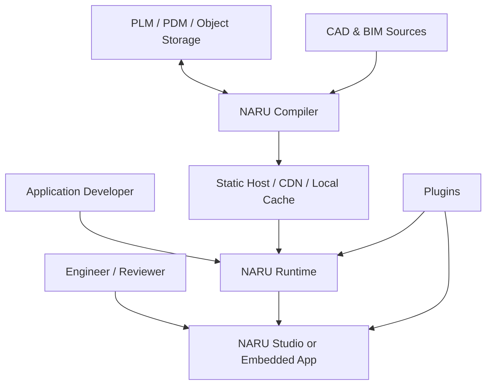
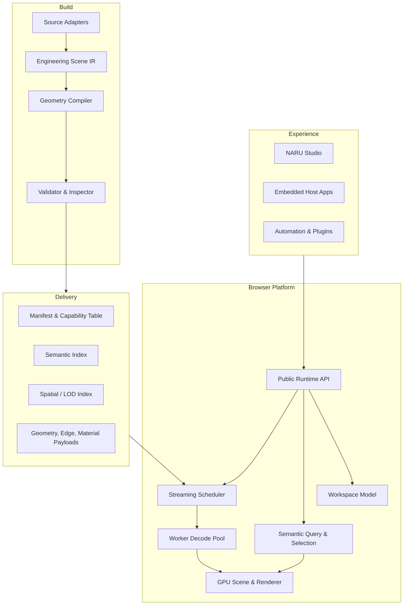
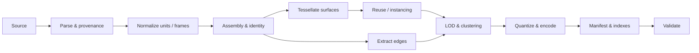
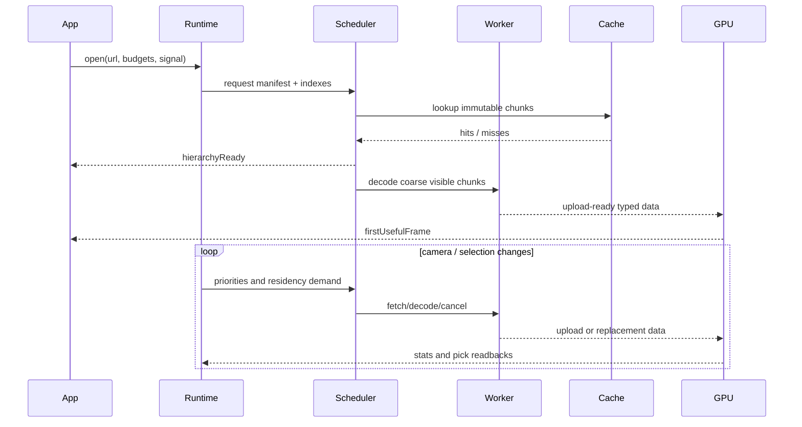
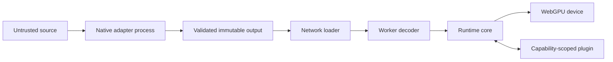

# NARU System Architecture

Status: Draft 0.1

## 1. Architectural objective

NARU converts engineering sources into a semantic scene that can be opened and
used progressively in a browser. It separates source interpretation, logical
scene meaning, delivery representation, runtime residency, and user workspace
state so each can evolve independently.

The architecture optimizes for four qualities:

1. **Scale:** hundreds of thousands of occurrences without a corresponding
   JavaScript object per rendered element.
2. **Time to useful interaction:** hierarchy and visible coarse geometry arrive
   before the full model.
3. **Openness:** source adapters, storage, runtime, and Studio are replaceable
   components with public contracts.
4. **Trustworthy engineering context:** units, hierarchy, occurrence identity,
   source provenance, and approximation level remain explicit.

## 2. Context



No central NARU service is required. An organization may run compilation in CI,
on a workstation, beside a PLM system, or as a private service. Output can be
served from ordinary static storage.

## 3. Layered model



Dependency direction points downward. Studio may depend on runtime, but runtime
never depends on Studio. Compiler and browser share logical schemas and test
fixtures, not OCCT types or native implementation state.

## 4. Core components

### 4.1 Source adapters

Adapters translate source-specific structures into the neutral IR. Each adapter
owns parsing, source units, source hierarchy, source IDs, exact topology
references, colors/materials, and tessellation requests.

An adapter declares capabilities such as:

- assembly hierarchy;
- B-Rep topology;
- exact curve/surface evaluation;
- PMI/GD&T;
- stable persistent IDs;
- source-side tessellation;
- incremental revision information.

The compiler adapts its output and warnings to those capabilities rather than
pretending every source provides equal semantics.

### 4.2 Engineering Scene IR

The IR is a logical contract, initially represented in memory. It models source
documents, prototypes, occurrences, semantic entities, geometry
representations, materials, edges, coordinate frames, metadata, and provenance.

The IR is intentionally not identical to a disk schema or GPU buffer layout.
This prevents an early storage decision from becoming a permanent public model.

### 4.3 Compiler

The compiler performs deterministic transforms:

- validate and normalize hierarchy, units, and coordinates;
- identify shared prototypes and instancing opportunities;
- tessellate and preserve explicit CAD edges;
- build coarse and exact-display representations;
- partition into streamable spatial/draw clusters;
- quantize attributes within local coordinate frames;
- generate bounds, errors, dependencies, and priority hints;
- compress payloads and emit manifests and indexes; and
- verify output through structural and visual tests.

### 4.4 Delivery profile

Delivery is a manifest plus immutable chunks. It may use glTF-compatible
payloads, 3D Tiles concepts, and established codecs. A future `.naru` package or
optimized cache container may bundle these resources, but it is not a source
CAD format and is not frozen before benchmarks justify it.

Every compiled scene declares:

- schema/version;
- feature and decoder requirements;
- source provenance and compiler options;
- root coordinate frame and units;
- semantic and spatial index entry points;
- chunk IDs, byte sizes, hashes, bounds, dependencies, and priority classes;
- estimated decoded and GPU memory.

### 4.5 Browser runtime

The runtime opens a scene in stages:

1. Validate manifest and capabilities.
2. Load hierarchy, semantic summary, bounds, and coarse content.
3. Create model state and renderable proxies.
4. Schedule chunks based on view, selection, predicted motion, and budgets.
5. Decode in Workers and upload into pooled GPU allocations.
6. Update visibility and draw state without total-scene JS traversal.
7. Refine or evict content as priorities change.

### 4.6 Workspace

The workspace is user-authored state above source scenes:

- source URIs and expected revisions;
- source-to-workspace transforms;
- views, cameras, clip volumes, and render settings;
- selection sets, annotations, and review states;
- plugin-owned versioned data; and
- optional portable thumbnails or summaries.

Workspace data never silently embeds proprietary source geometry. Portable
embedding, if added, must be explicit.

### 4.7 Plugin host

Plugins extend commands, panels, import/export, query, analysis, overlays, and
automation. They receive capability objects instead of direct access to
internals. Plugins cannot mutate core scene state outside transactions.

## 5. Compiler data flow



The compiler should support streaming intermediate results so very large source
models do not require every representation to be resident at once.

## 6. Browser execution model



Main-thread responsibilities are limited to application events, view state,
scheduling decisions, resource publication, and command encoding. Heavy decode,
decompression, and optional semantic indexing occur in Workers.

## 7. Runtime state model

Runtime state is structured as dense tables rather than one rich JS object per
source object.

```text
ModelState
├── document table
├── prototype table
├── occurrence table
│   ├── parent index
│   ├── prototype index
│   ├── local/world transform reference
│   ├── visibility/selection bits
│   └── semantic reference
├── representation table
├── chunk residency table
├── bounds and spatial index
├── material table
└── source identity table
```

Ergonomic public object handles are lightweight views over IDs and tables. They
must not recreate a retained tree of mutable render objects.

## 8. GPU architecture

### 8.1 Data layout

- Large shared vertex/index/edge pools, suballocated by chunk.
- Storage buffers for transforms, object state, material references, and
  per-draw metadata.
- Compact object/feature IDs suitable for an ID render target.
- Local quantized vertex positions decoded relative to a chunk/prototype origin.
- Separate surface and edge representations.
- Per-view visible/draw tables generated from coarse batches and optional
  compute passes.

### 8.2 Frame graph

An initial frame may contain:

1. upload/copy work;
2. transform/bounds update for changed occurrences only;
3. visibility and LOD classification;
4. depth prepass when justified by scene profile;
5. opaque surface pass;
6. edge pass;
7. transparent/emphasis pass;
8. selection/outline and annotation overlays;
9. object-ID pass, continuous or on demand; and
10. post-processing and presentation.

WebGPU does not currently provide every native GPU-driven drawing mechanism on
all targets. The implementation therefore treats compute culling and indirect
draws as measured optimizations, not an architectural assumption. Instancing,
coarse batching, render bundles, and bounded command recording are first-class
fallback strategies.

## 9. Precision and coordinates

WGSL rendering primarily uses 32-bit floating point. The scene therefore uses a
hierarchy of coordinate spaces:

```text
source coordinates (double on CPU)
    -> workspace coordinates (double on CPU)
        -> document/chunk local origin
            -> quantized or f32 local vertex coordinates on GPU
                -> camera-relative view coordinates
```

Rules:

- Units are explicit at every source boundary.
- Large translations are never baked into low-precision vertex positions.
- Bounds retain enough CPU precision for stable scheduling and measurement.
- Repeated transformations have a canonical double-precision composition path.
- Plugins declare the coordinate space of every geometry or point they provide.

## 10. Identity model

Identity is layered because CAD exports rarely guarantee one universal stable
ID:

- `DocumentId`: a source document in the workspace.
- `RevisionId`: immutable source/compiler revision fingerprint.
- `PrototypeId`: a reusable part or geometry definition.
- `OccurrenceId`: one placement in an assembly path.
- `SemanticId`: a queryable source/business entity.
- `RepresentationId`: a render/analysis representation.
- `ChunkId`: immutable delivery content.
- `SourceRef`: adapter-specific path, label, persistent ID, or topology token.

Cross-revision matching is a service with confidence and evidence, not equality
of runtime IDs.

## 11. Caching and transport

### Network

- Static HTTP(S) is the baseline transport.
- Immutable chunks use content hashes and long-lived cache headers.
- Small manifests/indexes may be version-addressed and short-lived.
- Range requests are optional; correctness cannot depend on every CDN handling
  one compressed monolith efficiently.
- Request priorities are advisory and implemented with bounded concurrency.

### Browser cache

- Cache API or storage abstraction for immutable compressed chunks.
- Explicit storage quota and eviction policy.
- Decoded CPU cache and GPU residency are independent budget tiers.
- Cache entries are namespaced by schema and decoder compatibility.

### Local files

Studio may use File System Access/OPFS where supported, but runtime APIs accept
abstract resolvers so local, CDN, PLM, signed URL, and test sources share the
same loader contract.

## 12. Failure and recovery

Typed errors include:

- unsupported source/manifest/schema feature;
- source revision mismatch;
- network unavailable or unauthorized;
- checksum mismatch;
- decoder validation failure;
- CPU/GPU budget exceeded;
- GPU capability missing;
- GPU device lost; and
- plugin compatibility/capability violation.

Partial scene failure should preserve usable content and surface affected
objects/chunks. Retries use backoff and are cancellable. Device loss rebuilds
pipelines and resident resources without requiring a full source recompile.

Compiler-side cancellation is implemented rather than proposed. An aborted
import terminates the native adapter and every process it started, removes the
temporary Scene IR directory it was extracting into, and never removes a
previously verified cache entry. Package publication is the one section that
runs to completion regardless, because the package writer is not atomic and a
cancel observed midway would leave a directory that looks like a package and is
not one; the cancellation event says so instead of hiding it
([ADR-0020](adr/0020-cancellable-import-jobs.md)).

## 13. Security architecture



Important controls:

- native adapters can be isolated as processes or containers;
- output validators run independently of source adapters;
- chunk hashes and strict schemas guard the network boundary;
- decoders validate offsets/counts before allocation or copy;
- plugins cannot access network/filesystem unless granted by the host;
- runtime budgets protect against valid-but-hostile large data;
- errors and telemetry exclude source metadata by default.

## 14. Observability

The runtime publishes structured, opt-in local statistics:

- request queue, bytes, cache hits, and cancellations;
- decode time and worker utilization;
- semantic/geometry readiness milestones;
- decoded and GPU-resident memory;
- visible occurrences, triangles, edges, batches, and draw calls;
- culling/LOD counts;
- frame CPU encode and GPU timing where available;
- pick and query latency; and
- device loss/recovery events.

The compiler publishes a separate, versioned stream for one import:
`naru.import-job-event.2`. It reports lifecycle states in a fixed order with a
gapless sequence, monotonic elapsed milliseconds, and progress counted in
lifecycle steps rather than estimated from source size. Every field is scrubbed
of filesystem paths, and sources appear as digest and byte length rather than
name, so an event can cross a trust boundary the source document never should.
`naru compile` and `naru compile-ifc` emit it as newline-delimited JSON under
`--json-events` ([ADR-0020](adr/0020-cancellable-import-jobs.md)). With
`--staged-preview` an IFC import also reports each document's verified
assembly tree as a `staged` event while extraction continues
([ADR-0021](adr/0021-staged-hierarchy-first-import.md)).

These stats power the built-in inspector and reproducible benchmarks. They are
not sent anywhere by the core runtime.

## 15. Proposed implementation boundaries

The exact monorepo structure is deferred, but the intended dependency graph is:

```text
@naru3d/schema        logical IDs, manifests, feature negotiation
@naru3d/scene-ir      in-memory neutral model
@naru3d/runtime       framework-neutral browser runtime
@naru3d/runtime-webgpu WebGPU backend
@naru3d/workspace     workspace transactions and persistence
@naru3d/plugin-sdk    public extension contracts
@naru3d/studio        reference web application
native/compiler     compiler orchestration
native/adapter-occt STEP/IGES implementation
native/adapter-ifc  IFC federation implementation
tools/inspect       manifest/cache inspector
tools/benchmark     repeatable benchmark runner
```

`TypeGPU` may be used inside `runtime-webgpu`; it does not appear in `schema`,
serialized artifacts, or public logical scene contracts.

## 16. Compatibility and versioning

- Semantic versioning applies to packages after their first stable release.
- Cache/manifest compatibility uses explicit major/minor schema versions and
  required/optional feature lists.
- Unknown required features fail early; unknown optional features are ignored
  with diagnostics.
- Workspace migrations are pure, versioned transforms with backups managed by
  the host application.
- Pre-1.0 caches are disposable and may require recompilation.

## 17. Architecture validation strategy

The architecture is considered validated only when the vertical slice proves:

1. A real STEP assembly becomes a neutral IR without OCCT types leaking into
   the runtime.
2. The browser renders a useful frame before full scene download.
3. Assembly selection maps back to source references.
4. Explicit CAD edges survive the compile/runtime boundary.
5. Memory remains inside configured budgets through eviction.
6. The same runtime is embedded in both Studio and a minimal standalone sample.
7. Benchmarks distinguish gains due to data layout/streaming from gains due
  merely to different visual quality.
