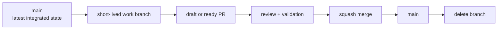

# Branching and Release Policy

Status: Active 1.0

This policy keeps NARU easy to contribute to while protecting the history and
reliability of the default branch. It applies to maintainers, contributors, and
automated agents.

## Model

NARU uses a lightweight GitHub Flow:



`main` is the only permanent development branch. NARU does not use a long-lived
`develop`, `dev`, or integration branch during the architecture and early alpha
phases. Release branches are added only when the project supports more than one
release line.

## Default branch contract

`main` represents the latest integrated, reviewable state of the project.

- Do not develop directly on `main`.
- Every change reaches `main` through a pull request.
- Keep `main` buildable and internally consistent once implementation begins.
- Do not force-push, rewrite, or delete `main`.
- A merged change must be independently revertible.
- Architecture, schema, API, security-boundary, and major dependency changes
  require an ADR as described in [the contribution guide](../CONTRIBUTING.md).

Repository rules enforce the mechanical parts of this contract. Maintainers are
subject to the same normal workflow as external contributors.

## Work branch names

Use a short, lowercase, slash-separated name. Add an issue number when one
exists.

| Prefix | Use | Example |
|---|---|---|
| `feat/` | User-visible capability or public API | `feat/123-progressive-loader` |
| `fix/` | Correctness or compatibility correction | `fix/418-selection-id-overflow` |
| `docs/` | Documentation-only change | `docs/branch-policy` |
| `perf/` | Benchmark-backed performance work | `perf/gpu-culling-batches` |
| `refactor/` | Internal structure with no intended behavior change | `refactor/chunk-index` |
| `test/` | Tests, fixtures, or benchmark harnesses | `test/step-occurrence-fixture` |
| `build/` | Build, packaging, CI, or dependency infrastructure | `build/webgpu-ci` |
| `spike/` | Time-boxed feasibility experiment | `spike/occt-xde-identity` |
| `release/` | Maintainer-created supported release line | `release/0.1` |

Tool-managed branches such as `codex/branch-policy` are allowed. They follow the
same lifetime, review, and deletion rules as human-created work branches.

Avoid personal names, generic names such as `changes` or `test`, and branches
that combine unrelated work.

## Change workflow

1. Start from the current `main`.
2. Create one branch for one logical change.
3. Open a Draft PR early for risky, cross-cutting, or collaborative work.
4. Keep the PR description current as the design changes.
5. Update from `main` before final review when the branch is stale or conflicts.
6. Mark the PR ready only after applicable local validation passes.
7. Resolve every review conversation before merging.
8. Squash-merge the PR and delete the work branch.

Long-running efforts should be divided into independently useful PRs. A shared
feature branch is an exception for coordinated work, not a substitute for
incremental integration.

## Pull request requirements

A pull request should contain:

- a concise problem statement and summary of the approach;
- the relevant issue using `Closes #123` or an explanation of why no issue is
  needed;
- validation commands and results, or a reason validation is not applicable;
- user-visible, compatibility, schema, security, and performance impact;
- documentation, tests, fixtures, and ADR updates required by the change; and
- confirmation that no proprietary or unlicensed engineering data is included.

PR titles use the repository's change categories because the title becomes the
squashed commit subject. Examples:

```text
feat: stream coarse geometry before target LOD
fix: preserve occurrence identity across instancing
docs: define branch and release policy
perf: batch explicit edge draws by material class
```

During the single-maintainer bootstrap phase, a PR is required but a peer
approval is not. The author performs and records self-review. When a second
active maintainer joins, the ruleset moves to at least one approving review and
dismisses stale approvals after new commits.

## Merge strategy

NARU uses **squash merge** for ordinary pull requests.

- Merge commits and rebase merges are disabled in repository settings.
- The PR title becomes the commit subject on `main`.
- The PR discussion remains the durable record of intermediate commits and
  design feedback.
- Fix the PR title before merging; do not repair history afterward.
- Delete the head branch automatically after merge.

Direct pushes are not an ordinary maintainer shortcut. In a critical security or
repository-recovery emergency, the owner may temporarily change enforcement.
The exception must be followed by an issue or PR documenting what changed, why
the normal process could not be used, and how recurrence will be prevented.

## Validation gates

NARU enables required checks only after each check exists and has succeeded on a
real pull request. This prevents a missing workflow from blocking every merge.

The required pull-request checks are:

- documentation links and formatting;
- lint and type checking;
- unit and schema tests;
- build and WebGPU shader validation; and
- license and fixture provenance checks.

Performance claims also follow [the benchmark contract](BENCHMARKS.md); a green
generic CI job is not a substitute for reproducible benchmark evidence.
Completed-decision and host-specific evidence is not charged to every pull
request. It remains committed, runs in the weekly evidence audit and release
audit, and is mandatory whenever a change touches that record. The exact tier
membership and native/headed/memory recording profiles are defined in
[the validation policy](VALIDATION.md).

## Release branches

Do not create a release branch merely to organize unfinished work. Create
`release/<major>.<minor>` only when NARU publishes and actively supports that
release line while `main` moves toward the next one.

- New features continue to target `main`.
- Fixes normally land on `main` first.
- A maintainer backports an applicable fix with `git cherry-pick -x`.
- A release branch accepts fixes, documentation, packaging, and compatibility
  work—not unrelated features.
- Every backport is validated against the release branch.
- Unsupported release branches are archived or deleted according to the
  published support policy.

Before that point, prereleases are cut directly from `main`.

## Tags

Release tags use Semantic Versioning, including prerelease identifiers:

```text
v0.1.0-alpha.1
v0.1.0-beta.1
v0.1.0
```

Tags matching `v*` are immutable. Repository rules block updating or deleting a
published release tag. If a release is wrong, publish a corrected version rather
than moving the tag.

## Experiments and prototypes

`spike/` branches are time-boxed and make no compatibility promise. Record the
question, success criterion, and conclusion in an issue or the eventual PR.
Useful results are rewritten into a reviewable PR; abandoned spikes may be
deleted after their conclusions are captured.

## Security work

Do not open a public branch or PR for an undisclosed vulnerability. Follow the
[security policy](../SECURITY.md) and use GitHub's private vulnerability
reporting or another maintainer-approved private channel. The public fix follows
the normal branch and release process when disclosure is safe.

## Enforced repository settings

The GitHub repository is configured with the following baseline:

| Area | Enforcement |
|---|---|
| Default branch | `main` |
| Merge method | Squash merge only |
| Work branches | Automatically deleted after merge |
| `main` deletion | Blocked |
| Force pushes to `main` | Blocked |
| `main` history | Linear history required |
| Changes to `main` | Pull request required |
| Required approvals | `0` during single-maintainer bootstrap |
| Review conversations | Must be resolved |
| Required status checks | Added after the corresponding CI exists |
| Web editor commits | DCO sign-off required |
| Release tags matching `v*` | Update and deletion blocked |

Review this table whenever repository settings change. Policy text and GitHub
enforcement should not silently diverge.

## Policy evolution

Increase controls when the project reaches the corresponding condition:

| Condition | Policy change |
|---|---|
| Second active maintainer | Require one approval and dismiss stale approvals |
| Stable CI on real PRs | Require named lint, test, build, and documentation checks |
| Path ownership becomes clear | Add `CODEOWNERS` and require code-owner review for critical paths |
| Multiple supported releases | Create `release/x.y` branches and publish a support window |
| High PR volume | Consider merge queue and stricter branch freshness |

Changes to this policy use the same PR process and should explain the problem
being solved rather than copying a more complex project's workflow.
