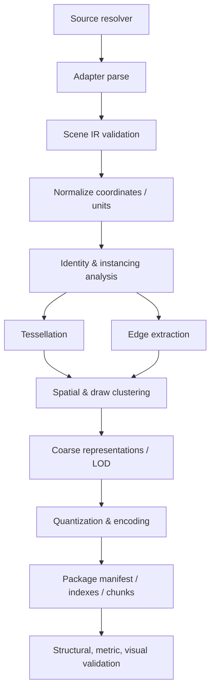

# Geometry Compiler

Status: Draft 0.2

## 1. Mission

The compiler turns source-specific engineering data into immutable,
progressively loadable, GPU-ready scene artifacts while preserving enough
semantic and source mapping for engineering interaction.

It is closer to an asset compiler than a file converter. Output is optimized for
a declared runtime profile and can be rebuilt from authoritative sources.

## 2. Command-line concept

```sh
pnpm naru compile assembly.step \
  --output ./dist/assembly \
  --linear-tolerance 0.1 \
  --angular-tolerance 0.15 \
  --spatial-index \
  --spatial-leaf-capacity 64
```

This local AP242/AP214 command is executable. It requires the pinned
CadQuery/OCP environment documented in `packages/compiler/README.md`, records
both adapter and compiler reports, and removes its temporary expanded Scene IR.
`--spatial-index` is optional and is also available to `compile-ifc`; the leaf
capacity flag is valid only with it. Profile, coarse-error, and service-oriented
options remain future compiler work.

Other commands:

```text
naru inspect ./dist/assembly/manifest.json
naru validate ./dist/assembly
naru diff old/manifest.json new/manifest.json
naru benchmark ./dist/assembly --scenario review-default
```

The inspection, diff, and benchmark commands below remain illustrative.

## 3. Pipeline



Stages consume and produce versioned artifacts in development builds so faults
can be inspected without reparsing the source.

## 4. Source resolution

The source resolver handles:

- local files and directories;
- HTTP(S) with explicit allowlists and credentials supplied by the host;
- object storage and PLM/PDM connectors;
- referenced subassemblies;
- source digesting and revision fingerprints;
- temporary staging with configurable quotas.

It never places credentials in compiler output. URI redaction is configurable.

## 5. Adapter contract

```ts
interface SourceAdapter {
  readonly id: string;
  readonly version: string;
  probe(source: SourceHandle): Promise<ProbeResult>;
  open(source: SourceHandle, options: AdapterOptions): Promise<AdapterSession>;
}

interface AdapterSession {
  capabilities(): AdapterCapabilities;
  readScene(signal?: AbortSignal): AsyncIterable<SceneIREvent>;
  evaluateExact?(request: ExactGeometryRequest): Promise<ExactGeometryResult>;
  close(): Promise<void>;
}
```

The actual native boundary may use C ABI, IPC, or files rather than TypeScript.
The semantics are the contract.

### OCCT adapter responsibilities

- STEP/IGES document import;
- XDE assembly hierarchy, names, colors, layers, and external references;
- source label/path capture;
- shape validation and optional healing diagnostics;
- controlled tessellation using documented tolerances;
- explicit topology edge extraction and classification;
- optional face/edge source mapping;
- release of OCCT objects after each compilation partition.

OCCT is not linked into the browser runtime.

### IFC adapter responsibilities

- preflight IFC2X3/IFC4/IFC4X3 Part 21 documents independently;
- preserve document-scoped GlobalIds and source hashes across a federation;
- map project/site/building/storey containment plus decomposition, type, group,
  and classification relationships;
- retain queryable property sets separately from render geometry;
- extract local geometry and occurrence placement without baking every product
  into world-space vertices;
- preserve mapped-representation reuse through shared prototypes; and
- normalize source units while retaining each document's original unit scale.

IfcOpenShell and Open CASCADE remain in an isolated compiler process. IFC edge
and curve semantics are not inferred from triangle adjacency when the adapter
cannot classify them reliably.

## 6. Normalization

Normalization produces a canonical, deterministic scene:

- convert units without losing source-unit metadata;
- convert handedness/up-axis into the selected profile;
- preserve high-precision document origins;
- canonicalize names and strings without destroying originals;
- reject or diagnose non-finite data;
- compute hierarchy paths and occurrence transforms;
- validate duplicate IDs and cycles;
- sort deterministic tables by canonical identity.

## 7. Instancing and reuse

The compiler first preserves authored prototypes. It may then detect additional
geometry reuse when safe.

Reuse keys can include:

- exact source prototype ID;
- canonical shape hash;
- tessellated geometry hash;
- material and edge representation compatibility.

Detected reuse must not merge semantic identity. Distinct occurrences continue
to carry their own metadata, visibility, selection, and source mapping.

Compiler reports include:

- authored prototype count;
- occurrence count;
- unique geometry count before/after detection;
- geometry and GPU memory saved;
- hash/canonicalization cost.

## 8. Tessellation

Tessellation options are explicit and recorded:

- linear/chordal deflection;
- angular deflection;
- relative vs absolute tolerance;
- per-part or per-size adaptation;
- normal generation/smoothing policy;
- UV retention;
- seam and degenerate triangle handling.

The compiler should support at least two display representations:

1. a coarse representation for early recognition; and
2. the target display tessellation for inspection.

Tiny components may use bounds or procedural proxies in coarse content, but the
manifest records that omission so selection/search can request them.

## 9. CAD edge extraction

Edges are extracted from source topology before the surface mesh is discarded.
For each edge, the adapter/compiler records:

- source reference when available;
- adjacent face count and references;
- boundary/seam/smooth/sharp classification;
- curve type hint and parameter range when useful;
- polyline representations at selected display errors;
- material/style association.

Mesh-derived edge fallback is labeled as derived and is never presented as
equivalent to source CAD topology.

## 10. Partitioning

Partitioning balances network, decode, culling, draw, and semantic operations.
One partition does not need to satisfy every concern; indexes can map among
spatial tiles, draw clusters, prototypes, and semantic objects.

Candidate policies:

- preserve prototype payloads separately from occurrence placement;
- group small, nearby, similarly rendered content into coarse draw clusters;
- keep very large prototypes independently streamable;
- bound compressed, decoded, and GPU sizes per chunk;
- avoid semantic fragmentation that makes object picking or visibility costly;
- retain enough locality for viewport-prioritized requests;
- represent chunk dependencies explicitly.

Partition metrics are emitted for tuning.

The first implemented spatial-demand contract follows ADR-0008. When the
compiler API is given `coarseBounds: true` and `spatialIndex: true`, it writes a
deterministic `naru.spatial-demand-index.1` `spatial.bin`: a flat float64 BVH
over renderable occurrence world bounds whose leaves reference existing target
chunks. Target and coarse geometry bytes are unchanged, so repeated prototype
payloads remain shared. The browser validates the binary layout, allocation
limits, tree ownership, and glTF/chunk references, then queries visible leaves
without fetching cold target chunks. Committed evidence is split: the focused
headed record passes under `artifacts/spatial-demand/`, while real-model
evidence remains the next slice. ADR-0008 is therefore still Proposed.

## 11. LOD and simplification

CAD simplification is conservative:

- prefer occurrence/prototype-level omission at distance before destructive
  simplification of critical small parts;
- preserve silhouettes and sharp/boundary edges;
- retain object identity and source mapping across LODs;
- prevent cracks or make crack risk explicit at part boundaries;
- never use simplified geometry for an operation labeled source-exact;
- store geometric error in model units and enough information for screen-space
  selection.

LOD generation is plugin/profile based so industries can define importance
rules for fasteners, pipes, equipment, or architectural components.

The first shape-preserving level, its ownership, serialized profile, and
selection rule are decided in
[ADR-0025](adr/0025-shape-preserving-lod-representation.md) (Accepted).
`--reduced-lod <meters>` implements the representation: for each prototype
the compiler simplifies the `target` surface with meshoptimizer (whole shape,
unlocked boundary, absolute error = the declared deviation), runs it twice so
a non-deterministic result is refused, and admits the result only if the
mesh-only #126 checks pass against the prototype's own `target`; otherwise
the prototype retains `target` with a reason in `build-report.json`
`reducedLod`. Admitted levels are welded, carry the explicit edge segments,
and follow the target payloads in `scene.bin` as `reduced:NNNN:<prototype>`
chunks declared in `extras.naru.progressive.reducedChunks`
(`naru.progressive-package.2`); a package compiled without the flag keeps
`extras.madi.progressive`. Gate 1 is recorded in
[`artifacts/lod/reduced-level/`](../artifacts/lod/reduced-level/README.md).

## 12. Quantization and precision

Positions are encoded relative to local prototype/chunk origins. Candidate
encodings include:

- 16-bit or 20/24-bit quantized positions where error bounds permit;
- 32-bit local positions for detailed or small-range parts;
- octahedral normal encoding;
- compact material and source-map indices;
- 16-bit indices for subclusters where beneficial, otherwise 32-bit.

Every quantized representation records bounds and worst-case positional error.
The compiler rejects a profile when requested accuracy cannot be represented.

The current standards-first glTF profile keeps prototype geometry and transform
linear components as f32. Occurrence translations are serialized as ordinary
JSON numbers; values remain f32-compatible when rounding error is at most
10 nm, and otherwise retain JavaScript number precision for the NARU loader's
camera-relative path. This is not a custom glTF extension. The threshold and
the resulting package digests are fixed by the ADR-0005 0.25 mm / 10,000 km
record and `pnpm precision:check`.

## 13. Compression

Compression is chosen per payload class:

- geometry codec optimized for decode speed and GPU-ready ordering;
- general-purpose compression for semantic/index columns when suitable;
- KTX2/Basis for textures;
- independent chunks to preserve random access;
- optional dictionary/schema sharing without making every chunk dependent on a
  large global blob.

Codec selection is a manifest feature. The runtime can reject unsupported
required codecs before downloading their payloads.

## 14. Manifest and indexes

The compiler emits logical resources such as:

```text
manifest.json
indexes/
  hierarchy.bin
  semantics.bin
  spatial.bin
  sources.bin
chunks/
  prototype-....bin
  cluster-....bin
  edges-....bin
  materials-....bin
```

The physical layout is experimental. Each resource has:

- content ID/hash;
- media type and schema version;
- compressed/decoded/GPU byte estimates;
- dependencies;
- bounds and geometric error where relevant;
- feature requirements;
- optional alternate URI/range location.

## 15. Determinism

With identical source bytes, adapter/compiler versions, options, and target
profile, output content IDs should be identical.

Sources of nondeterminism to control:

- unordered map iteration;
- thread completion order;
- floating-point reduction order;
- timestamps and temporary paths;
- generated IDs;
- compression library configuration;
- OCCT algorithm/version differences.

Build metadata that should not affect content identity lives outside hashed
payloads.

## 16. Incremental compilation

Incremental compilation is a P1/P2 capability. The design reserves for:

- source document/revision graph;
- adapter-provided changed persistent IDs;
- prototype content hashes;
- chunk reuse based on normalized content;
- manifest revision that references unchanged chunks;
- invalidation of dependent spatial/semantic indexes.

Correct full rebuilds come before clever incremental behavior.

## 17. Validation

### Structural

- schema and feature compatibility;
- hashes and sizes;
- index/reference ranges;
- hierarchy acyclicity;
- finite bounds and transforms;
- declared coordinate spaces;
- decoded/GPU size estimates within tolerance.

### Geometric

- source vs compiled bounds;
- triangle/edge counts and degenerate rates;
- tessellation distance sampling where exact source access exists;
- normal orientation and watertightness diagnostics;
- quantization error bounds;
- visual snapshot comparison from canonical cameras.

### Semantic

- source entity/occurrence/prototype count reconciliation;
- source-reference coverage;
- unit/property preservation;
- explicit records for dropped/unsupported content.

## 18. Build report

Every compilation writes a machine-readable report with:

- timings and peak memory by stage;
- source and output sizes;
- object/prototype/occurrence/triangle/edge/material counts;
- instance reuse and compression ratios;
- LOD and chunk histograms;
- warnings/errors grouped by source reference;
- target profile and decoder requirements;
- reproducibility identity.

## 19. Initial vertical slice

The first compiler is intentionally narrow:

1. one local STEP AP242 file;
2. OCCT XDE hierarchy and colors;
3. one coarse and one target display tessellation;
4. explicit edge polylines;
5. prototype/occurrence preservation;
6. simple spatial bounds and fixed-size chunks;
7. unoptimized or minimally compressed typed payloads;
8. manifest, inspector, and independent validator.

Advanced LOD, compression, incremental builds, and proprietary adapters follow
only after the runtime proves the basic model.

## 20. Phase 1 standards-first slice

`@naru3d/compiler` now compiles a validator-clean in-memory `EngineeringScene`
into `scene.gltf`, external `scene.bin`, and `build-report.json`. Direct STEP
compilation additionally emits `coarse.bin` with one reusable prototype AABB
surface/edge mesh per target mesh. The first
committed packages are under `artifacts/phase1/repeated-fasteners` for focused
regression and `artifacts/phase1/adafruit-pygamer` for the canonical real-world
electronics path.

The glTF profile uses standard node hierarchy, shared mesh references, triangle
and line primitives, materials, metre units, and Y-up coordinates. Occurrence,
prototype, semantic, diagnostic, and source-reference fields live in
`extras.madi`; no custom extension is required. This is an experimental profile
under ADR-0004, not a frozen NARU format.

The build is deterministic for identical Scene IR and options. The normal check
runs both NARU invariants and the official Khronos glTF Validator. The current
slice keeps target geometry as the ordinary node mesh and records its coarse
mesh index in standard `extras`. This proves representation-separated delivery,
and `targetChunks` maps target prototype meshes to deterministic, non-overlapping
`scene.bin` byte ranges. The IFC compile path coalesces adjacent prototype
ranges into 512 KiB requests (without splitting an oversized prototype), which
turns the qualified Digital Hub package from 3,383 prototype ranges into 45
network/decode units. This proves partial range delivery and static request
scheduling. The optional `spatialPayloadOrder` compiler flag (CLI:
`--spatial-payload-order`) adds `targetPayloadOrder:
"spatial-leaf-anchor-v1"`, orders each prototype by the deterministic BVH leaf
where most of its occurrences land, and then applies the same byte budget.
The project-owned four-prototype oracle changes one localized co-demand set
from two target chunks to one while preserving one payload per prototype,
coarse bytes, and deterministic output. The default prototype-ID order remains
byte-identical. Digital Hub and sixty5 now reproduce lower leaf requested and
off-view bytes; localized headed traces remain pending. Shape-preserving LOD
is implemented behind `--reduced-lod` and recorded in
[`artifacts/lod/reduced-selection/`](../artifacts/lod/reduced-selection/README.md).

Pretty-printed `scene.gltf` remains the deterministic default, at every size:
the compiler writes the document as a stream, so the default formatting is no
longer bounded by the runtime's maximum string length (see below). IFC
compilation may still pass `--compact-json` (API: `compactJson: true`) to drop
insignificant whitespace from a real-large document. The build report records
`jsonFormatting: "compact"`; parsed glTF values, buffer bytes, and accessor
semantics are unchanged. The committed explicit-edge sixty5 record uses this
path so that its digests stay comparable to the packages already recorded,
while historical package digests remain unchanged when the option is absent.

Large packages may also pass `--omit-resource-names` (API:
`omitResourceNames: true`) to remove optional diagnostic `name` strings from
meshes, buffer views, and accessors. Scene, node, and material names remain, as
do every `extras` identity/source-mapping field; the option therefore does not
weaken assembly navigation, picking, properties, or source traceability. The
build report records `resourceNames: "omitted"`, and the option participates in
compiled-cache identity. Named output remains the deterministic default and is
byte-identical when the option is absent. The 31-document [engineering-scale
qualification](../artifacts/ifc/engineering-baseline/README.md) records the
compact/omitted combination and a Khronos-clean package.

Two further opt-in options reduce the node array, which the [document byte-split
record](../artifacts/compiler/node-field-elision/README.md) measures at 36.2% of
the engineering baseline's 405,570,167-byte document.
`--elide-derived-identifiers` (API: `elideDerivedIdentifiers: true`) declares one
document-level rule at `extras.madi.nodeIdentityDerivation` and omits each
`semanticId` or `sourceRef` that rule reconstructs; a node whose value does not
follow the rule keeps it explicitly, and a node with no such identity serializes
`null`. `--omit-default-node-transforms` (API: `omitDefaultNodeTransforms: true`)
drops an identity `matrix` and writes `translation` for a translation-only one,
never decomposing a rotation or scale. The build report records
`nodeIdentifiers: "derived-elided"` and `nodeTransforms: "default-omitted"`, both
options participate in compiled-cache identity, and the default output is
byte-identical when they are absent. Measured together on the engineering
baseline they remove 23,459,373 B (5.78%); the same record ranks mesh-less
hierarchy nodes (21.88%) above both, which ADR-0015 leaves to its own slice.

That slice is `--relocate-hierarchy-nodes` (API:
`relocateHierarchyNodes: true`), under proposed
[ADR-0017](adr/0017-relocated-hierarchy-sidecar.md). It writes the mesh-less
nodes to a package sidecar instead of the document (section 21.3), keeps only
the nodes that draw — each carrying its composed world matrix, with `children`
gone and every retained node a scene root — and records
`hierarchyNodes: "relocated"` in the build report beside `hierarchyUri` and
`hierarchyBinaryUri`. The option participates in compiled-cache identity and is
off by default, so existing package digests are unchanged. Measured in the
[relocation record](../artifacts/compiler/hierarchy-relocation/README.md), it
takes the engineering baseline's document from 405,570,167 to 317,466,183 B
(−21.72%, 163,664 of 268,002 nodes) while the whole package falls 2.72%,
because the sidecar that now carries the tree costs 64,825,238 B. The document
is the resource a client must parse in full before drawing; the package is not.

The public `naru compile` entry now accepts a local AP242 or AP214 Part 21 file,
invokes the isolated OCCT adapter, verifies schema and source digest parity,
and writes the compiled package plus `adapter-report.json`. The committed
`repeated-fasteners-ap242` package is generated through that exact command.

The PyGamer baseline contains 34 shared meshes, 85 renderable occurrences,
162,838 triangles, and 13,897 explicit edge segments. Its 14.8 MB binary is
deliberately uncompressed so later chunking, LOD, compression, and residency
work has a stable public baseline.

## 21. First IFC federation slice

The executable `naru compile-ifc` path accepts repeated discipline/document
pairs, preflights their Part 21 envelopes, invokes pinned IfcOpenShell 0.8.5,
cross-checks every source digest, validates the resulting Scene IR, and uses the
same standards-first glTF compiler as STEP.

The adapter boundary uses a split Scene IR transport rather than one expanded
JSON document. The adapter writes structure-only JSON whose representation
surfaces reference a separate little-endian geometry file, and reports a
SHA-256 for each half; the compiler verifies both and resolves the references
into typed-array views without copying. On Digital Hub this replaced an
81,805,061-byte document with a 39,135,637-byte structure and a 28,134,848-byte
geometry file, and reproduced the same compiled package digest.

Since `madi.ifc-scene-ir-split.2` the adapter also interns semantic property
keys: every distinct key (1,656 on Digital Hub) and key combination (279) is
stored once in the scene-level `propertyIndex`, and each semantic entity
references one combination plus its aligned values (`docs/SCENE_IR.md`
section 8). That shrank the Digital Hub structure to 30,592,935 bytes (−21.8 %)
while `scene.bin`, `coarse.bin`, every compiler count, and all 273,188
resolvable property values stayed identical; `scene.gltf` changed only through
the recorded `optionsDigest` (`propertyMode: "indexed-flattened-psets"`).

Property value columns (`madi.ifc-scene-ir-split.3`) then moved the values
themselves out of the structure JSON into a third binary adapter output
(`scene-ir-properties.bin`, `madi.property-columns.1`): each semantic entity
now carries only `{set, row}`, and the column file stores every distinct value
once as canonical compact JSON — on Digital Hub, 334,225 encoded value entries
deduplicate into 48,649 distinct values in a 670,783-byte heap, a
2,260,991-byte column file overall. That shrank the Digital Hub structure
again to 26,235,818 bytes (−14.2 % from split.2) while the geometry file,
`scene.bin`, `coarse.bin`, and every compiler count stayed identical. The
compiler verifies the column file structurally at hydrate time — header
digests, offset tables monotone and bracketing, every row's arity matching its
interned key set — through u32 typed-array views only, without materializing
the value table; values decode lazily through
`resolvePropertyEntries`/`openPropertyValueColumns` in `@naru3d/scene-ir`.
`scene.gltf` kept its byte length with a digest change explained by the
recorded `optionsDigest` (`propertyMode: "indexed-column-values"`).

Explicit IFC boundaries are the next deliberate transport revision:
`naru.ifc-scene-ir-split.4` writes IfcOpenShell/OpenCascade face-boundary
indices, boundary classes, and originating IFC representation-item ids into
the geometry stream. Edge and surface positions share one stream reference
when they use the same tessellation vertices, and the glTF compiler likewise
reuses one POSITION accessor. The focused project-owned wall record contains
12 topological boundary segments while its triangle wireframe contains 18
unique edges, proving that the six face diagonals are not promoted to authored
geometry (`artifacts/ifc/explicit-edges/`). Historical split.3 real-model
records remain accepted and byte-reproducible.

The compiler never holds the structure document as one string. A
record-streaming reader (`packages/compiler/src/ifc-structure-stream.ts`)
walks the file in bounded chunks with a byte-level state machine, parses each
top-level array record individually, and hashes every byte on the way through
for the adapter-identity check, producing exactly the object graph `JSON.parse`
would. That removes the runtime's 536,870,888-code-unit maximum string length
as a compile boundary; only the largest single record must fit one string.
Chunk-boundary, malformed-record, and error-reporting behavior is unit-checked
in `packages/compiler/test/ifc-structure-stream.test.ts`, and the reader
reproduces the Digital Hub package digest byte for byte.

The output document is not held as one string either. `compileSceneToGltf`
returns `scene.gltf` as a streamed document (`packages/compiler/src/json-stream.ts`
and `json-document.ts`): the value is walked once to produce the digest and byte
length the build report declares, feeding the package hash in the same pass, and
walked again when the packager writes the file, so no step allocates the whole
document. The chunks concatenate to exactly what `JSON.stringify(document, null,
indent)` produced before, because strings are escaped by `JSON.stringify` itself,
finite numbers are formatted with `String`, and keys come from `Object.keys`;
`packages/compiler/test/json-stream.test.ts` compares the two over compiled
document shapes, every number form, escape and key-order edge cases, and a
300-document randomized corpus. The measured effect is that the sixty5
federation's default pretty-printed document reaches 545,470,166 bytes against
the runtime's 536,870,888-byte maximum string length and compiles (accepted
[ADR-0016](adr/0016-streamed-gltf-document.md), recorded in
`artifacts/cache/sixty5/`), while its compact package stays byte-identical to
the digest recorded before the change.

The qualified Digital Hub result combines four IFC4 documents into 13,681
occurrences, including 5,152 renderable products. It preserves 3,383 unique
geometric prototypes and 1,769 reused occurrences, reducing 2,534,364 submitted
triangles to 913,520 unique triangles. The compiled package passes the official
Khronos validator with zero errors and warnings. Compact reports and the
reproduction command live under `artifacts/ifc/digital-hub/`.

This now also exercises the first Phase 2 scheduler boundary: its 3,383
prototype-granular ranges compile into 45 request chunks, the browser updates
only changed GPU batches, and fixed decoded/GPU admission caps retain coarse
fallbacks when pressure is reached. The optional spatial-demand sidecar,
authenticated loader, and frustum query scheduler now exist, but this committed
Digital Hub package predates them. Focused headed evidence passes, while
indexed real-model evidence, LOD, and cache tiers remain deferred. The focused
E2.1 record proves IFC boundary extraction; Digital Hub itself remains a
historical surface-only split.3 package until its next licensed re-recording.

### 21.1 Real-large compile status

The qualified `ifc-bench-sixty5` federation's split.1 structure measured
631,943,761 bytes — past the runtime's maximum string length, which used to
stop `naru compile-ifc` at a measured limit. The record-streaming structure
reader removed that ceiling, and the split.1 compile is recorded in the
repository history (commit `41e6973`): a 608.2 MB package byte-identical
across two complete runs including adapter re-extraction, peaking at ≈3.8 GB
compiler working set inside the default V8 heap.

Property indexing (`madi.ifc-scene-ir-split.2`) then shrank the sixty5
structure to 419,502,749 bytes (−33.6 %, interning 35,510 distinct keys and
299 key combinations) — back under the maximum string length, so the boundary
crossing itself is now historical; the streaming reader remains the compile
path and still protects against any future federation crossing it again.

Property value columns (`madi.ifc-scene-ir-split.3`) shrank the sixty5
structure again to 345,472,410 bytes (−17.6 % from split.2, 45.3 % below
split.1): the 5,225,296 encoded value entries deduplicate into 488,526
distinct canonical-JSON values in a 7,555,294-byte heap, a 31,179,862-byte
column file overall, and the hydrated scene no longer materializes a single
property value — the compiler checks every row's arity against its interned
key set through u32 typed-array views. The current record in
`artifacts/ifc/sixty5/` carries package digest
`773652cf45658ec0179b0eec9f0f3628177abd194d413b5f0dc7a883f7ad6049` with
188,320 glTF nodes, 84,870 meshes, 78,173 renderable occurrences, and
4,866,386 unique triangles, passing the Khronos validator with zero errors and
warnings; `scene.bin`, `coarse.bin`, every compiler count, the geometry half,
and all 4,503,078 resolvable property values are unchanged from the earlier
records, with `scene.gltf` keeping its exact byte length and differing only
through the recorded `optionsDigest`. The recording compile's Node process
peaked at 3,845,181,440 bytes working set (≈3.6 GB, sampled at 2 s intervals)
against the split.1 record's 4,043,804,672 bytes — a recording note, not a
benchmark result.

### 21.2 Package property sidecar

A compiled package built from a column-bag scene republishes the semantic
properties as two optional package resources, so a viewer can resolve
`key -> value` entries for a picked occurrence without the Scene IR
intermediate: `properties.bin` is the adapter column file byte for byte
(same length and SHA-256 as `scene-ir-properties.bin`), and `properties.json`
is a `madi.package-properties.1` document — compact single-line JSON carrying
the scene/revision/source identity, the interned `propertyIndex`, a columnar
semantic table (code-unit-sorted `semanticIds` aligned with interned schema
references and `{set, row}` columns), the column file reference, and the
`madi.property-columns.1` header verbatim (`docs/SCENE_IR.md` section 8).
`scene.gltf` points at the sidecar through
`extras.madi.properties = {schemaVersion, uri, byteLength, sha256}`, both
resources join `output.resources` and the package digest
(glTF → target → coarse → sidecar JSON → sidecar binary), and the sidecar is
mandatory whenever the scene declares `propertyValues` — `compileSceneToGltf`
refuses a column-bag scene without `options.propertyColumns` and vice versa
(`packages/compiler/test/gltf.test.ts`). The STEP path is unchanged: inline
`PropertyBag` scenes emit no sidecar, and the committed Phase 1 packages are
byte-identical. The glTF profile and compiler-report schema are also
unchanged — the sidecar is additive, and the occurrence nodes' existing
`extras.madi.semanticId` is the join key the runtime and Studio use
(`packages/runtime-webgpu/src/compiled-gltf.ts`,
`apps/webgpu-spike/src/property-sidecar.ts`). Full-text search deliberately
does not index property values in Phase 1; the Studio resolves properties
lazily for the selected occurrence only.

### 21.3 Package hierarchy sidecar

`--relocate-hierarchy-nodes` republishes the assembly tree as two further
optional resources. `hierarchy.json` is a `naru.package-hierarchy.1` document —
compact single-line JSON carrying the scene/revision/source identity, the
document node count it was built against, the column file reference, and the
entry and relocated counts, plus a section table and the interned tag sets —
and `hierarchy.bin` holds the entries as columns: node indexes, depths, flags
(renderable, initial visibility, and which identities were omitted), tag-set
references, interned local transforms, and five string columns (`name`,
`occurrenceId`, `prototypeId`, `semanticId`, `sourceRef`), each an offset
table over its own heap. `scene.gltf` points at the header
through `extras.madi.hierarchy = {schemaVersion, uri, byteLength, sha256,
entryCount, relocatedCount}`, both resources join `output.resources` and the
package digest after the property sidecar, and both participate in
compiled-cache identity.

What stays in the document is exactly the nodes that draw. Each carries its
composed world matrix, so no ancestor is needed to place it; `children` is
gone, and every retained node is listed in the scene. Reading the tree back
therefore requires the sidecar, and the runtime says so rather than guessing
(`docs/RUNTIME.md`, "Reading the assembly tree").

The option is off by default and changes the package digest when it is on, so
every committed package stays byte-identical without it. The
[relocation record](../artifacts/compiler/hierarchy-relocation/README.md)
measures both sides on two federations and proves a Digital Hub round trip:
13,681 entries and 5,152 occurrence world transforms return identical.

### 21.4 Persistent source-package cache

`naru compile` and `naru compile-ifc` can opt into a content-addressed cache
with `--cache <directory>`. The `naru.compiled-cache-entry.1` key covers source
roles and digests, a cheap exact adapter implementation/toolchain identity, the
compiler host identity, and every option or stable source label serialized into
the package. Absolute source/output paths and UI state are excluded.

Entries are immutable flat resource sets. The compiler checks the manifest key,
path policy, byte count, and SHA-256 of every resource before it atomically
restores an output, and it atomically publishes only after normal package
validation. STEP and IFC orchestration tests prove that a verified unchanged
hit preserves the package digest and skips native extraction; IFC tests also
prove that changing a serialized URI hint causes a miss. Real pinned-toolchain
cold/warm evidence and per-discipline dependency indexing are intentionally
separate gates in [the import/cache contract](IMPORT_AND_CACHE.md).

### 21.5 IFC incremental dependency index

Every IFC federation compile now writes `incremental-dependencies.json` with
schema `naru.ifc-incremental-dependency-index.1`. The derived sidecar maps a
discipline and source digest to its Scene IR document, semantic entities,
prototypes, occurrences, current progressive target chunks, and logical
selectors for coarse, spatial, and property invalidation. A second prototype
table records every contributing document and current target chunk. All lists
are sorted, and provenance comes from Scene IR source references and semantic
ownership rather than ID parsing.

Cross-document semantic relations expand to their transitive document
component, so changing one member conservatively invalidates every reconciled
member. The planning API distinguishes changed, deleted, added, and
stable-content renamed/relabelled sources; ambiguous equal-digest renames are
never guessed. The whole-package cache manifest includes and verifies the
sidecar, and cache hits restore it without invoking the adapter.

This closes the dependency-index prerequisite in
[ADR-0010](adr/0010-ifc-incremental-dependency-index.md). When `--cache` is
selected, the compiler also gives the adapter an `ifc-documents/` tier. The
adapter hashes each source, then restores or atomically publishes a verified
canonical-JSON/gzip artifact keyed by discipline, digest, URI hint, threads,
and exact adapter/toolchain fingerprint. Report schema
`naru.ifc-adapter-report.6` records ordered hit/miss coverage, which the compiler
checks against every selected discipline. Corruption is a miss, and executable
serialization such as pickle is never loaded.

The actual two-discipline explicit-wall test proves cold and warm outputs plus
a one-document-changed merge reproduce clean adapter structure, geometry, and
property bytes exactly. Target/coarse/spatial/property package files remain
federation-wide, so their physical bytes cannot be reused from this logical
index alone because packing and column offsets may change. Complete-package
byte-equivalence under a changed discipline is recorded
([record](../artifacts/cache/payload-reuse/README.md)); a compiled reuse unit
that is cheaper to restore than to rebuild remains before per-discipline
compilation is a complete product claim;
[ADR-0019](adr/0019-document-artifact-transport.md) names that unit -- the
verified per-document Scene IR artifact, restored across the adapter-compiler
transport -- and the gates it must pass. Its first slice, artifacts verified
from their stored bytes (`naru.ifc-document-artifact.2`, pinned by the
compiler in [`ifc-federation.ts`](../packages/compiler/src/ifc-federation.ts)),
is [recorded](../artifacts/cache/rebuild-stages/README.md) against a
same-session clean rebuild on Digital Hub and sixty5, with byte-identical
packages, a lower whole-process rebuild median, and lower peak memory on both.
The structure scan and
the federation re-merge it leaves are slices 2 and 3.

[ADR-0018](adr/0018-content-addressed-compiled-payloads.md) was the reviewed
design for that payload tier: reuse one unit, the prototype payload -- the
accessor bytes and placement-free accessor metadata `appendGeometry` produces
for a prototype -- and rebuild every other package resource, `scene.bin`
included, from the current scene. It was implemented behind `--payload-cache`,
measured, and rejected by its own gate, and ADR-0019 removed the flag with its
store, selection logic, and recorder; 21.6 below describes what the compiler
kept from it.

### 21.6 What the payload tier left behind

[ADR-0018](adr/0018-content-addressed-compiled-payloads.md) was implemented in
full -- a content-addressed store, per-prototype selection inside the
packaging loop, and `--payload-cache <directory>` on both commands -- and its
acceptance record
([artifacts/cache/payload-reuse](../artifacts/cache/payload-reuse/README.md))
proved the equivalence half, every clean-package byte reproduced on Digital
Hub and sixty5, and failed the saving half: restoring verified payloads took
2.2-2.4x the packaging time of re-encoding them. The ADR is Rejected, and
[ADR-0019](adr/0019-document-artifact-transport.md) removed the flag, the
store (`naru.compiled-payload-entry.1`), the selection logic, the
`build-report.json:compiledPayloadCache` block, their tests, and the record's
recorder (2026-09-03). The record stays committed as the measurement that
closed the tier and `pnpm cache:payload:check` keeps validating it; it can no
longer be re-recorded.

Two things stayed because they moved no bytes. Encoding and placement remain
separate functions: `buildCompiledPayload(representation, scaleToMeters)`
produces the payload -- the ordered accessor byte blobs plus the accessor
metadata that does not depend on placement -- and
`appendCompiledPayload(builder, payload)` places it into `scene.bin`.
`appendGeometry` is exactly those two calls, so byte offsets, padding, and
bufferView and accessor indices are decided in one place. Compiling Digital
Hub through the split reproduces the `digital-hub` baseline package digest
recorded in
[artifacts/compiler/node-field-elision](../artifacts/compiler/node-field-elision/README.md).
`compiledPayloadContentDigest(representation)`, the store's content key, is
kept as a tested pure function: it hashes the representation ID, every surface
and edge array together with its element type, and whether the edge positions
alias the surface ones, so equal numbers in a `Float64` and a `Float32` array
do not collide.

The safety rules the store shared with the whole-package cache stay in
`cache-primitives.ts`, which now serves that cache alone: a key that is not 64
hex characters is refused before it can reach the filesystem, resource paths
match one portable file-name pattern, `lstat` refuses a symlink instead of
following it out of the store, publication stages in a `mkdtemp` sibling and
renames into place, and Windows `EPERM` on a rename onto an existing directory
is read as the same lost race as `EEXIST` and `ENOTEMPTY`.

### 21.7 Import lifecycle and staged hierarchy

Both CLI compile paths expose the cancellable `naru.import-job-event.2`
lifecycle described in [the import contract](IMPORT_AND_CACHE.md).
IFC `--staged-preview` publishes verified per-document hierarchy pairs during
extraction; [ADR-0021](adr/0021-staged-hierarchy-first-import.md) distinguishes
the adapter timing record from compiler determinism/cancellation tests and the
end-to-end Studio record. A staged tree is temporary derived output, not a
cache entry or a coarse geometry representation.

The `naru.staged-import-preview.2` manifest adds a final-package handoff block
that a Studio consumer follows
([Studio guide](../apps/webgpu-spike/README.md#follow-a-staged-import)); the
[cold-import record](../artifacts/import/staged-import-browser/README.md)
measures that end to end on sixty5. The handoff cannot establish a coarse
frame during extraction, so ADR-0021 is accepted as hierarchy-first only.
