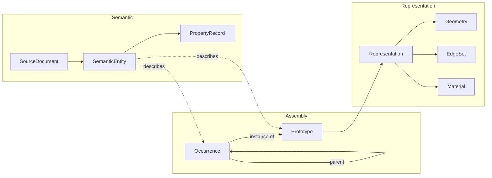

# Engineering Scene IR

Status: Draft 0.1
Scope: logical in-memory contract between source adapters and compiler stages

## 1. Purpose

The Engineering Scene IR preserves the meaning needed by engineering
applications while allowing render representations to be aggressively compiled.
It is not a CAD kernel object model, a GPU layout, or a commitment to a binary
format.

The IR must answer four independent questions:

1. **What is this?** Semantic identity, properties, classification, provenance.
2. **Where is it?** Assembly occurrence and coordinate transforms.
3. **How can it be displayed?** Surface, edge, point, annotation, and LOD
   representations.
4. **How accurate is this information?** Source/exact/display provenance and
   tolerances.

## 2. Graph separation



The graphs have references, not shared ownership. One semantic entity may
describe an occurrence, a prototype, a face, a system, or something with no
render geometry. One prototype may have several display and analysis
representations.

## 3. Identifier rules

All IR IDs are opaque typed values, not array offsets exposed to callers.
Compiler/runtime implementations may map them to dense indices.

```ts
type Brand<T, B extends string> = T & { readonly __brand: B };

type DocumentId = Brand<string, "DocumentId">;
type RevisionId = Brand<string, "RevisionId">;
type SemanticId = Brand<string, "SemanticId">;
type PrototypeId = Brand<string, "PrototypeId">;
type OccurrenceId = Brand<string, "OccurrenceId">;
type RepresentationId = Brand<string, "RepresentationId">;
type MaterialId = Brand<string, "MaterialId">;
type SourceRefId = Brand<string, "SourceRefId">;
```

Requirements:

- Unique within one `SceneRevision`.
- Deterministic for the same normalized source and compiler identity rules.
- Never inferred from mutable display order.
- Not promised stable across source revisions unless the adapter supplies a
  persistent source key.
- Cross-revision matches carry method, confidence, and evidence.

## 4. Root scene model

```ts
interface EngineeringScene {
  schemaVersion: string;
  sceneId: string;
  revision: SceneRevision;
  units: UnitSystem;
  rootFrame: CoordinateFrame;
  documents: SourceDocument[];
  propertyIndex?: PropertyIndex;
  prototypes: Prototype[];
  occurrences: Occurrence[];
  semantics: SemanticEntity[];
  representations: Representation[];
  materials: Material[];
  diagnostics: Diagnostic[];
}

interface SceneRevision {
  id: RevisionId;
  sourceDigest: string;
  adapter: ToolIdentity;
  compiler?: ToolIdentity;
  createdAt: string;
  optionsDigest: string;
}
```

Timestamps are provenance and never participate in deterministic content hashes.

## 5. Source documents and provenance

```ts
interface SourceDocument {
  id: DocumentId;
  uriHint?: string;
  displayName: string;
  mediaType?: string;
  format: string;
  formatVersion?: string;
  sourceDigest: string;
  revisionLabel?: string;
  units: UnitSystem;
  sourceFrame: CoordinateFrame;
  adapterCapabilities: AdapterCapabilities;
  sourceRefs: SourceReference[];
  metadata: PropertyBag;
}

interface SourceReference {
  id: SourceRefId;
  documentId: DocumentId;
  namespace: string;
  value: string;
  kind:
    | "document"
    | "assembly-node"
    | "part"
    | "body"
    | "face"
    | "edge"
    | "vertex"
    | "property"
    | "external";
  stability: "persistent" | "revision-local" | "heuristic";
}
```

`uriHint` may be removed or rewritten for portable/private builds. A digest is
required even when no source URI is published.

## 6. Prototype and occurrence

A prototype is reusable authored content. An occurrence is one placement of a
prototype in an assembly.

```ts
interface Prototype {
  id: PrototypeId;
  name?: string;
  semanticId?: SemanticId;
  sourceRef?: SourceRefId;
  representationIds: RepresentationId[];
  localBounds: Bounds3d;
  defaultMaterialId?: MaterialId;
  metadata: PropertyBag;
}

interface Occurrence {
  id: OccurrenceId;
  parentId?: OccurrenceId;
  prototypeId: PrototypeId;
  name?: string;
  semanticId?: SemanticId;
  sourceRef?: SourceRefId;
  localTransform: Matrix4d;
  materialOverrideId?: MaterialId;
  initialVisibility: boolean;
  tags: string[];
  metadata: PropertyBag;
}
```

Rules:

- The occurrence tree must be acyclic and have deterministic sibling order.
- A transform is double precision in the IR/compiler.
- Prototype geometry is expressed in a local frame suitable for reuse.
- Per-occurrence overrides remain compact and cannot silently duplicate a
  prototype representation.
- Empty/group occurrences are allowed.

The project-owned `createLargeCoordinatePrecisionScene()` fixture exercises
this contract with identical local f32 plate geometry and double-precision
near/far occurrence transforms. Its 0.25 mm gap at a 10,000 km offset is the
committed ADR-0005 compiler/runtime evidence gate.

## 7. Semantic entities

Semantic entities are queryable business/source concepts. They are not required
to have geometry.

```ts
interface SemanticEntity {
  id: SemanticId;
  documentId: DocumentId;
  type: string;
  name?: string;
  description?: string;
  sourceRef?: SourceRefId;
  parentIds: SemanticId[];
  relationIds: SemanticRelation[];
  properties: SemanticProperties;
  classification?: Classification[];
}

interface SemanticRelation {
  type: string;
  targetId: SemanticId;
  metadata?: PropertyBag;
}
```

The semantic graph may be a DAG. Runtime queries use explicit indexes rather
than traversing arbitrary nested JSON.

## 8. Property model

```ts
type PropertyValue =
  | null
  | boolean
  | number
  | string
  | { type: "quantity"; value: number; unit: string }
  | { type: "enum"; value: string; schema?: string }
  | { type: "uri"; value: string }
  | { type: "array"; values: PropertyValue[] };

interface PropertyBag {
  schema?: string;
  entries: Record<string, PropertyValue>;
}

interface PropertyIndex {
  keys: string[]; // distinct, codepoint-sorted
  sets: number[][]; // distinct strictly-ascending key-index tuples, sorted lexicographically
}

interface IndexedPropertyBag {
  schema?: string;
  set: number; // index into propertyIndex.sets
  values: PropertyValue[]; // values[i] belongs to keys[sets[set][i]]
}

interface ColumnPropertyBag {
  schema?: string;
  set: number; // index into propertyIndex.sets
  row: number; // row into the external propertyValues columns
}

type SemanticProperties = PropertyBag | IndexedPropertyBag | ColumnPropertyBag;

interface PropertyColumnStreamRef {
  encoding: "u32le" | "utf8-json";
  byteOffset: number; // absolute, 8-byte aligned inside the column file
  byteLength: number;
}

interface PropertyValueColumns {
  encoding: "madi.property-columns.1";
  valueCount: number; // total value references across all rows
  rowCount: number;
  distinctValueCount: number;
  rows: PropertyColumnStreamRef; // u32 distinct-value index per (row, position)
  rowOffsets: PropertyColumnStreamRef; // rowCount + 1 offsets, in value counts
  valueOffsets: PropertyColumnStreamRef; // distinctValueCount + 1 byte offsets
  valueHeap: PropertyColumnStreamRef; // distinct canonical-JSON values, byte-sorted
}
```

Properties are typed and unit-aware. Compiler profiles may columnarize common
properties and externalize cold property sets.

Semantic property keys repeat heavily across entities of the same type, so a
scene may intern them: the optional scene-level `propertyIndex` holds every
distinct key and key combination once, and an `IndexedPropertyBag` references
one combination plus its aligned values. A scene may go one step further and
move the values themselves out of the document: the optional scene-level
`propertyValues` header describes a binary column file in which every distinct
value is stored once as canonical compact JSON (UTF-8, object keys sorted,
non-finite numbers rejected, heap sorted by encoded byte sequence), and a
`ColumnPropertyBag` keeps only its key-set index plus a row into the u32
reference columns. `openPropertyValueColumns` in `packages/scene-ir` validates
the header and the offset tables (monotone, bracketing, references in range)
and returns a lazy browser-safe reader that decodes each distinct value at
most once on first use; `resolvePropertyEntries` joins any of the three forms
back to concrete `key -> value` entries losslessly (column bags require the
reader). `validateScene` checks what the document alone can prove: index
integrity for indexed bags (unique non-empty keys, in-range ascending tuples,
set references, value arity) and set/row ranges for column bags — row arity
lives in the column file and is checked when the columns are opened. Inline
`PropertyBag` entries stay valid — the STEP/OCCT adapter still emits them —
while the IFC federation adapter emits column bags plus the column file
(validated per `scripts/validate-ifc-federation-evidence.mjs`, which pins the
measured structure-size reduction).

Compiled packages built from a column-bag scene republish the properties as a
package sidecar (`docs/COMPILER.md`, "Property sidecar"): `properties.json` is
a `madi.package-properties.1` document holding the property index plus a
columnar semantic table (sorted `semanticIds` with aligned schema/set/row
columns), and `properties.bin` is the adapter column file byte for byte.
`parsePackageProperties` in `packages/scene-ir` validates the sidecar document
(schema version, experimental status, index integrity, sorted-unique semantic
ids, aligned column lengths, in-range set/row/schema references, column file
reference, column header) and the same `openPropertyValueColumns` /
`resolvePropertyEntries` pair then serves `key -> value` lookups per semantic
id, so a viewer needs neither the Scene IR document nor the glTF to resolve
properties (`packages/scene-ir/test/package-properties.test.ts`).

## 9. Representations

```ts
interface Representation {
  id: RepresentationId;
  prototypeId: PrototypeId;
  purpose: "coarse-display" | "display" | "edges" | "analysis" | "collision";
  accuracy: AccuracyDescriptor;
  localFrame: CoordinateFrame;
  surface?: SurfaceGeometry;
  edges?: EdgeGeometry;
  points?: PointGeometry;
  bounds: Bounds3d;
  sourceMap?: RepresentationSourceMap;
}

interface AccuracyDescriptor {
  kind: "source-exact" | "tessellated" | "simplified" | "derived";
  linearTolerance?: number;
  angularTolerance?: number;
  unit?: string;
  notes?: string[];
}
```

Display representations can be replaced independently of semantic identity.

## 10. Surface geometry

The IR may hold adapter-owned mesh streams before compiler normalization.

```ts
interface SurfaceGeometry {
  primitive: "triangles";
  positions: Float64Array | Float32Array;
  indices: Uint32Array;
  normals?: Float32Array;
  uvs?: Float32Array;
  colorIds?: Uint32Array;
  materialGroups?: MaterialGroup[];
  faceSourceIds?: Uint32Array;
}
```

`faceSourceIds` maps triangles or groups to source faces through a compact table.
It is optional because some sources provide only display meshes.

## 11. Edge geometry

CAD edges are not triangle wireframes.

```ts
interface EdgeGeometry {
  positions: Float64Array | Float32Array;
  segments: Uint32Array;
  classes: Uint8Array;
  sourceIds?: Uint32Array;
  curveHints?: CurveHint[];
}

type EdgeClass =
  | "boundary"
  | "sharp"
  | "smooth"
  | "seam"
  | "silhouette-candidate"
  | "annotation"
  | "construction";
```

The compiler may approximate curves into polylines at multiple display errors,
but retains class and source mapping. Dynamic silhouettes are a runtime
classification and do not replace authored/explicit edges.

## 12. Materials

Materials prioritize engineering readability over full DCC shading.

```ts
interface Material {
  id: MaterialId;
  name?: string;
  baseColor: [number, number, number, number];
  metallic?: number;
  roughness?: number;
  doubleSided?: boolean;
  alphaMode?: "opaque" | "mask" | "blend";
  edgeStyle?: EdgeStyle;
  sourceRef?: SourceRefId;
}
```

Runtime emphasis (selected, ghosted, x-ray, hidden) is separate state and does
not clone materials.

## 13. Coordinates and units

```ts
interface UnitSystem {
  length: string;
  angle: string;
  scaleToMeters: number;
}

interface CoordinateFrame {
  id?: string;
  origin: [number, number, number];
  basis: [number, number, number, number, number, number, number, number, number];
  handedness: "right" | "left";
  upAxis: "X" | "Y" | "Z";
  crs?: string;
}
```

The normalized scene uses a right-handed convention selected by the compiler
profile. Adapters record every conversion. Georeferenced inputs retain CRS and
high-precision origin metadata.

## 14. Source maps and picking

Picking must resolve from pixels back to engineering context:

```text
pixel object ID
  -> runtime occurrence index
  -> OccurrenceId
  -> PrototypeId / SemanticId / SourceRef

optional primitive ID + barycentric location
  -> representation primitive
  -> source face/edge reference
```

Object picking is required in the first slice. Face/edge snapping is a separate
pipeline and may require CPU acceleration structures or exact-source services.

## 15. LOD semantics

LOD is represented by error and purpose, not only level numbers.

- `coarse-display`: recognizable proxy, may omit tiny parts.
- `display`: target visual tessellation for normal inspection.
- optional finer displays: generated for close inspection.
- `analysis`: never selected merely because it is visually convenient.

Occurrence identity remains constant while representation changes. A selected
object is not dropped solely because a coarse LOD omits its surface; the runtime
may force a selected-object representation to load.

How a `simplified` representation is generated, serialized, and selected is
decided in [ADR-0025](adr/0025-shape-preserving-lod-representation.md).

## 16. Diagnostics

```ts
interface Diagnostic {
  severity: "info" | "warning" | "error";
  code: string;
  message: string;
  documentId?: DocumentId;
  sourceRef?: SourceRefId;
  data?: PropertyBag;
}
```

Expected diagnostic categories include unsupported entities, invalid topology,
healing performed, tessellation failure, lost properties, unit ambiguity,
duplicate source IDs, non-invertible transforms, and precision risk.

Consumers branch on `code`, never on human-readable `message`. Within one
adapter evidence schema, a code keeps its severity and meaning; changing either
requires a schema revision. Diagnostics for omitted source content must resolve
to a `SourceReference` when the source format exposes an addressable entity.

The Phase 0 OCCT evidence defines these codes:

| Code | Severity | Meaning |
|---|---|---|
| `PHASE0_OCCT_PYTHON_BINDING` | info | Evidence came through the OCP Python binding rather than the native C++ target. |
| `OCCT_UNSUPPORTED_PRESENTATION_LAYER_ASSIGNMENT` | warning | A STEP `PRESENTATION_LAYER_ASSIGNMENT` was not mapped; supported geometry remains available. |

The unsupported-entity warning uses the `step:entity-instance` namespace and
records `entityId`, `entityType`, `capability`, and `handling` in its property
bag. The adapter build report mirrors the Scene IR diagnostic counts, codes,
and unsupported-entity records.

## 17. IR invariants

A validator enforces:

- unique typed IDs;
- valid references;
- acyclic occurrence hierarchy;
- finite transforms and bounds;
- declared units;
- index ranges and attribute counts;
- material and representation consistency;
- source-map ranges;
- diagnostic coverage for dropped content; and
- deterministic canonical ordering for compilation.

## 18. Serialization stance

The IR starts as interfaces plus validation and fixture builders. It should not
be frozen as FlatBuffers/Protobuf/JSON until:

1. two independent adapters produce it;
2. the compiler completes an end-to-end vertical slice;
3. profiling identifies serialization bottlenecks; and
4. schema evolution tests exist.

Disk/cache schemas may intentionally differ from the IR while preserving its
observable semantics.

The IFC adapter is the first place where that freedom was exercised for a
measured reason rather than a preference. Its intermediate is now a split
transport: a structure-only JSON document whose representation surfaces hold
`{encoding, byteOffset, byteLength}` references into a separate little-endian
geometry file, with a SHA-256 recorded for each half. The compiler verifies both
digests and resolves the references into typed-array views without copying, so
the observable `EngineeringScene` is unchanged. This is an adapter-to-compiler
transport, not a delivery or cache format, and it is deliberately versioned so
it can be replaced deliberately: `madi.ifc-scene-ir-split.2` added the interned
`propertyIndex` (section 8), shrinking the structure document that previously
needed streaming past the engine string limit, and `madi.ifc-scene-ir-split.3`
moved the property values themselves into a third file — the binary
`madi.property-columns.1` value columns (section 8) — whose SHA-256 is
recorded and verified alongside the structure and geometry halves.
`naru.ifc-scene-ir-split.4` adds external edge indices, boundary classes, and
representation-item source ids; when edges share the surface vertices, both
members reference the same f64 position range instead of duplicating it.

## 19. Phase 0 extraction evidence

`artifacts/occt/repeated-fasteners.scene.json` records one complete vertical
slice produced from the licensed STEP assembly through OCCT 7.9.3 STEPCAF/XDE.
The repository test hydrates its numeric arrays, runs the normal validator, and
then compiles three part representations into ten render occurrences. The file
is intentionally evidence for this logical contract, not a declaration that
JSON is NARU's delivery format.

`artifacts/occt/unsupported-layer-assignment.scene.json` repeats that slice
with one known unsupported semantic entity. Its validator-clean scene retains
the same prototype reuse and geometry counts while resolving the warning to
STEP entity `#2135`.

`artifacts/occt/adafruit-pygamer.report.json` records the larger canonical
electronics fixture: 34 part prototypes, 85 part occurrences, 162,838 unique
triangles, and 13,897 edge segments. The extracted Scene IR JSON is 80.6 MB and
is intentionally generated under ignored `output/` storage instead of being
treated as a disk format or committed artifact. The checksum-locked STEP,
compact report, compiled glTF resources, and independent validators preserve
the reproducible evidence chain.

## 20. IFC federation extraction evidence

The isolated IfcOpenShell adapter is the second independent producer of the
same logical IR. Its Digital Hub slice covers multiple source documents,
document-scoped GlobalIds, spatial containment, type/group/classification
relationships, inherited property sets, local transforms, mapped geometry, and
material-separated surface representations.

The validated intermediate contains 14,675 semantic entities, 13,681
occurrences, 3,405 prototypes, 3,383 geometric representations, and 273,188
property values. Its 81.8 MB JSON is retained only when explicitly requested;
compact evidence under `artifacts/ifc/digital-hub/` binds the source documents,
adapter output, and compiled package by SHA-256.

This satisfies the “two independent adapters produce the IR” serialization
precondition, but does not freeze JSON or any other disk schema. Profiling,
schema-evolution tests, and larger-scene partitioning evidence are still
required. The original Digital Hub/sixty5 records retain their historical
`IFC_EDGE_EXTRACTION_DEFERRED` split.3 output. The focused split.4 record under
`artifacts/ifc/explicit-edges/` now proves 12 OpenCascade face-boundary segments
against an 18-edge triangle-wireframe control, excludes all six face diagonals,
and maps every emitted segment to its source `IfcExtrudedAreaSolid`; analytic
curve kinds and richer edge classes remain explicitly unproven.
